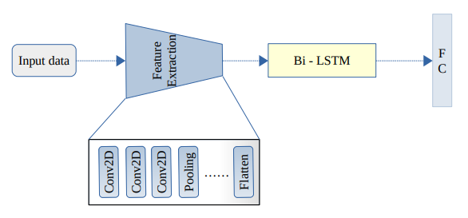

# Audio Chord Estimation

Audio chords are a fundamental piece of music and they are built over certain harmonic
rules, appearing appealing to the human ear. At the same time, deep learning is widely
known for it’s ability to discover non linear relationships on multi dimensional data. In this
thesis, through deep learning I will use models to aim and discover those relationships and
the point to that a neural network can learn some fundamental knowledge of music theory. 

## Introduction
This project focus on the exploration of various methods for each step of the process, including pre
processing, model architectures, training hyper parameters and post processing
techniques. There are some methods which helped improve the accuracy substantially,
and others that didn’t make a great impact on the result.

## Dataset
Isophonics dataset, created by Harte [3] providing 180 songs by The Beatles. The format of the data set, is 180 audio tracks on
mono .wav format at 44kHz sample rate, with their respective chord label files that have
the start and the end time of each chord appearance.

## Pre Processing

#### DSP
Constant Q transform with 192 frequency bins and 24 bins per octave

#### Data Augmentation

#### Chord Analysis

Non-popular modes appearances

## Model
Model Architecture

As it is evident from the data analysis done on chords, and confirmed by the training
process, most chord classes are under represented, a problem called imbalanced
classification. When the models sees 10K major chords but only 1000 minor chords it will
not be able to classify the minor chord as minor, and will label them as major.

Weight of class:

